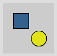

# Using Color Maps in Processing

This repository provides a class called ColorMap to ease work with sequential and diverging color 
maps in [Processing](https://processing.org/).

## Usage

````java
void setup() {
  size(100, 100);
}

void draw() {  
    ColorMap cmap = new ColorMap("viridis");
    
    // Draw a blue rectangle (color accessed by its index in the color map)
    fill(cmap.getColorIndex(80));
    rect(20, 20, 30, 30);
    
    // Draw a yellow circle (color accessed by the value in [0, 1] of the color map)
    fill(cmap.getColor(0.95));
    ellipse(70, 70, 30, 30);
}
````
will yield 



In order to be able to use `ColorMap` in your sketchbook, copy the file `ColorMap.pde` and the 
folder `colormaps` from the `ColorMapExample` folder to the folder of your sketchbook. See also the 
example provided in the `ColorMapExample` folder.

## Supported color maps

Currently, the class supports the following 
[colormaps](https://matplotlib.org/stable/tutorials/colors/colormaps.html) from 
[matplotlib](https://matplotlib.org/):

- Sequential perceptually uniform color maps: 
  `viridis`, `plasma`, `inferno`, `magma`, `cividis`

- Other sequential color maps:
  `Greys`, `Purples`, `Blues`, `Greens`, `Oranges`, `Reds`, `YlOrBr`, `YlOrRd`, 
  `OrRd`, `PuRd`, `RdPu`, `BuPu`, `GnBu`, `PuBu`, `YlGnBu`, `PuBuGn`, `BuGn`, `YlGn`

- Diverging color maps:
  `PiYG`, `PRGn`, `BrBG`, `PuOr`, `RdGy`, `RdBu`, `RdYlBu`, `RdYlGn`, 
  `Spectral`, `coolwarm`, `bwr`, `seismic`

